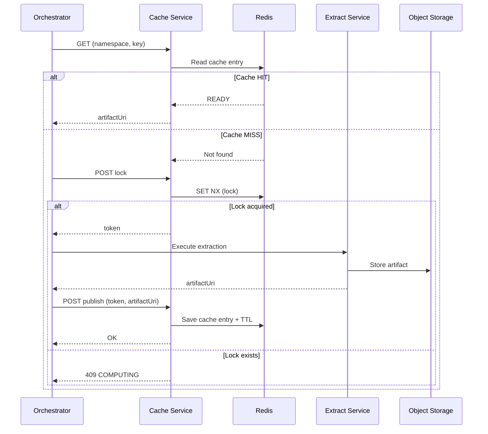

# Cache Service — Technical Documentation

Practical usage guide: [cache-service-usage.md](./cache-service-usage.md)

## 1. Overview

The **Cache Service** is a centralized microservice designed to **cache results of ETL operations** in order to avoid redundant computations.

In this architecture, **caching is handled exclusively at the Orchestrator level**:

* The Orchestrator decides whether to use the cache or execute a task
* Other services (Extract, Transform, Load) are **not aware of caching**

The Cache Service acts as a **generic key-value registry**:

* same request → same key → same result

---

## 2. Responsibilities

The Cache Service is responsible for:

* Checking if a result already exists (**cache hit/miss**)
* Coordinating execution using **distributed locks**
* Storing results (as references + metadata)
* Managing **TTL (expiration)**

It **does not perform any computation**.

---

## 3. Architecture

### Components

* **Orchestrator** (NestJS) → controls caching logic
* **Cache Service** (Spring Boot) → cache API
* **Redis** → storage (entries + locks)
* **ETL Services** (Extract, Transform, Load) → compute data
* **Object Storage** → stores artifacts

### Principle

```id="arch"
Orchestrator → Cache Service → Redis
Orchestrator → ETL Services → Object Storage
```

---

## 4. Data Model

### Cache Entry

Redis key:

```id="key1"
c:{namespace}:{key}
```

Type: Hash

Fields:

* `status`: READY | COMPUTING
* `artifactUri`: reference to result
* `metadata`: JSON (optional)
* `updatedAt`

TTL:

* defined at publish time

---

### Lock (Lease)

Redis key:

```id="key2"
l:{namespace}:{key}
```

Type: String

Fields:

* `token`
* `owner`

TTL:

* defined by `leaseMs`

Used to prevent concurrent computations.

---

## 5. API

### GET Cache

```id="api1"
GET /v1/cache/{namespace}/{key}
```

Responses:

* `200 READY`
* `404 MISS`
* `409 COMPUTING`

---

### LOCK

```id="api2"
POST /v1/cache/{namespace}/{key}/lock
```

Body:

```json
{ "owner": "orchestrator", "leaseMs": 300000 }
```

Responses:

* `200 OK` → returns a `token`
* `409 CONFLICT`

---

### PUBLISH

```id="api3"
POST /v1/cache/{namespace}/{key}/publish
```

Body:

```json
{
  "token": "...",
  "artifactUri": "s3://...",
  "metadata": {},
  "ttlSeconds": 86400
}
```

Responses:

* `200 OK`
* `403/409` if token is invalid

---

### DELETE (optional)

```id="api4"
DELETE /v1/cache/{namespace}/{key}
```

---

## 6. Request Lifecycle

### Normal Flow

1. Orchestrator generates a cache key
2. Calls `GET cache`

   * if HIT → return result
3. if MISS → calls `LOCK`
4. if lock acquired → calls ETL service
5. stores result in object storage
6. calls `PUBLISH`
7. lock expires or is released

---

### Concurrent Scenario

* A second request:

  * receives `409 COMPUTING`
  * retries later
  * eventually gets the result when READY

---

## 7. Sequence Diagram



---

## 8. Key Generation

The cache key must be:

* deterministic
* stable across executions

### Include:

* business parameters
* partition / time window
* service version
* input fingerprint

### Exclude:

* requestId
* timestamps
* non-deterministic values

### Format:

```id="keygen"
key = sha256(canonical_json(request))
```

---

## 9. Consistency & Concurrency

* Locks use Redis `SET NX PX`
* Only the lock owner can publish
* Locks expire automatically (lease)
* TTL ensures automatic cleanup

---

## 10. Error Handling

* expired lock → computation can restart
* invalid token → publish rejected
* Redis unavailable → fallback to no-cache mode (handled by orchestrator)

---

## 11. Performance

* Redis access is O(1)
* very low latency (<10ms typical)
* significantly reduces ETL recomputation

---

## 12. Summary

The Cache Service:

* centralizes caching logic
* is fully controlled by the Orchestrator
* prevents redundant ETL executions
* remains simple and generic

It relies on:

* deterministic keys
* Redis (TTL + locks)
* a minimal API
