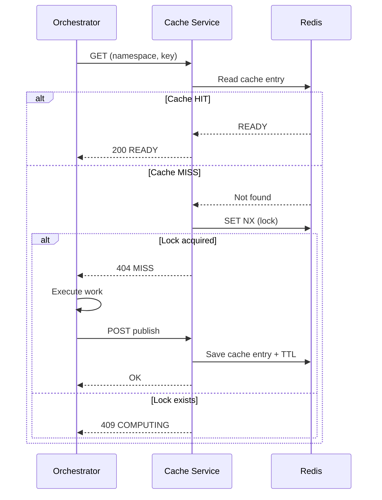

# Cache Service — Technical Documentation

Practical usage guide: [cache-service-usage.md](./cache-service-usage.md)

## 1. Overview

The **Cache Service** is a centralized microservice designed to cache orchestrated computations in order to avoid redundant work.

In this architecture, **caching is handled exclusively at the Orchestrator level**:

* The Orchestrator decides whether to use the cache or execute a task
* The Cache Service communicates only with the Orchestrator

The Cache Service acts as a **generic key-value registry**:

* same request → same key → same result

---

## 2. Responsibilities

The Cache Service is responsible for:

* Checking if a result already exists (**cache hit/miss**)
* Coordinating execution using **distributed locks**
* Storing cache state
* Managing **TTL (expiration)**

It **does not perform any computation**.

---

## 3. Architecture

### Components

* **Orchestrator** (NestJS) → controls caching logic
* **Cache Service** (Spring Boot) → cache API
* **Redis** → storage (entries + locks)

### Principle

```id="arch"
Orchestrator → Cache Service → Redis
```

---

## 4. Data Model

### Cache Entry

Redis key:

```id="key1"
c:{namespace}:{key}
```

Type: Hash

Fields:

* `status`: READY | COMPUTING
* `updatedAt`

TTL:

* defined at publish time

---

### Lock (Lease)

Redis key:

```id="key2"
l:{namespace}:{key}
```

Type: String

Fields:

* internal lock marker

TTL:

* defined by the configured default lease duration

Used to prevent concurrent computations.

---

## 5. API

### GET Cache

```id="api1"
GET /v1/cache/{namespace}/{key}
```

Behavior:

* if the key is missing, the service returns `404 MISS`
* after this miss, the service starts the internal lock workflow for the key

Responses:

* `200 READY`
* `404 MISS`
* `409 COMPUTING`

---

### LOCK

```id="api2"
POST /v1/cache/{namespace}/{key}/lock
```

Responses:

* `200 OK` → marks the key as `COMPUTING`
* `409 CONFLICT`

This endpoint remains public, but the orchestrator does not need to call it in the normal flow if `GET` already started the lock workflow.

---

### PUBLISH

```id="api3"
POST /v1/cache/{namespace}/{key}/publish
```

Behavior:

* marks the key as `READY`
* applies the configured TTL

Responses:

* `200 OK`
* `409` if no active lock exists

---

### DELETE (optional)

```id="api4"
DELETE /v1/cache/{namespace}/{key}
```

---

## 6. Request Lifecycle

### Normal Flow

1. Orchestrator generates a cache key
2. Calls `GET cache`

   * if HIT → return result
3. if MISS → the cache service starts the lock workflow for this key
4. the orchestrator runs its work
5. the orchestrator calls `PUBLISH`
6. lock expires or is released
7. a later `GET` returns `200 READY`
8. optionally the orchestrator calls `DELETE`

---

### Concurrent Scenario

* A second request:

  * receives `409 COMPUTING`
  * retries later
  * eventually gets the result when READY

---

## 7. Sequence Diagram



---

## 8. Key Generation

The cache key must be:

* deterministic
* stable across executions

### Include:

* business parameters
* partition / time window
* service version
* input fingerprint

### Exclude:

* requestId
* timestamps
* non-deterministic values

### Format:

```id="keygen"
key = sha256(canonical_json(request))
```

---

## 9. Consistency & Concurrency

* Locks use Redis `SET NX PX`
* Locks expire automatically (lease)
* Publish requires an active lock
* TTL ensures automatic cleanup

---

## 10. Error Handling

* expired lock → computation can restart
* Redis unavailable → fallback to no-cache mode (handled by orchestrator)

---

## 11. Performance

* Redis access is O(1)
* very low latency (<10ms typical)
* significantly reduces repeated work

---

## 12. Summary

The Cache Service:

* centralizes caching logic
* is fully controlled by the Orchestrator
* prevents redundant executions
* remains simple and generic

It relies on:

* deterministic keys
* Redis (TTL + locks)
* a minimal API
